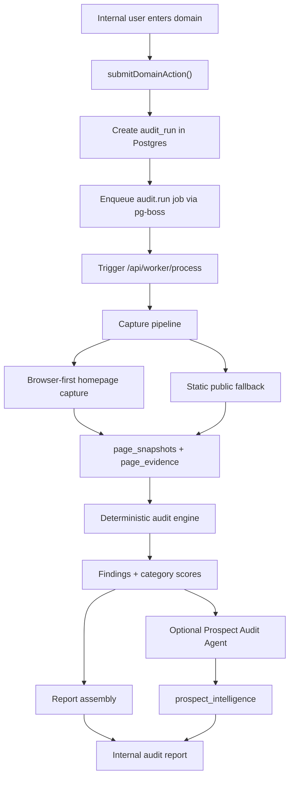

# Website Audit Agent


Evidence-bounded website audit workflow for internal prospecting, digital presence analysis, and brand-development intelligence.

`website-auditor` accepts a public website URL, captures authorized public evidence, produces deterministic audit findings and category scores, then optionally uses a bounded Gemini synthesis layer to translate accepted evidence into internal prospect intelligence.

The core architectural rule is simple:

> The deterministic audit engine creates audit truth.
> The LLM may synthesize accepted evidence, but it cannot invent findings, scores, metrics, traffic claims, revenue claims, or audit facts.

This repository is public for portfolio and reference purposes. The deployed Vercel app is private and no public demo is currently exposed.

---

## 30-second summary

Website Audit Agent is an internal audit system that evaluates public websites through a controlled workflow:

1. Capture public website evidence.
2. Extract technical, content, SEO, UX, and brand-relevant signals.
3. Generate deterministic findings and category scores.
4. Label evidence as measured, observed, or inferred.
5. Assemble a structured audit report.
6. Optionally use a bounded Gemini agent to translate accepted findings into prospecting intelligence.

The project is not a chatbot that gives website opinions. It is a bounded audit workflow where evidence capture, scoring logic, report generation, and LLM synthesis are separated by design.

---

## What this proves

This project demonstrates that I can:

* Design bounded AI workflows where the model is not the source of truth.
* Build full-stack internal tools with intake, storage, workers, reporting, and access control.
* Combine browser automation, deterministic scoring, database persistence, and LLM synthesis.
* Structure AI systems around evidence, traceability, validation, and human review.
* Translate a messy business-development problem into a repeatable decision-support system.
* Build AI-assisted tools that are useful without becoming uncontrolled autonomous agents.

---

## Why this exists

Most AI audit tools blur three things that should stay separate:

1. **Measured evidence** — what the system actually captured.
2. **Deterministic findings** — what rules can safely conclude from that evidence.
3. **Strategic synthesis** — how those findings may translate into business-development opportunities.

This project separates those layers.

It is not a system where an LLM “looks at a website” and invents conclusions. It is a controlled audit pipeline with evidence capture, deterministic scoring, persistence, worker execution, access control, and a constrained LLM synthesis layer.

The purpose is to create reliable internal prospect intelligence without turning model interpretation into fake measurement.

---

## What it does

### Audit intake

* Accepts a public website URL through an internal intake flow.
* Validates the URL before network activity.
* Creates an `audit_run` record in Postgres.
* Enqueues an `audit.run` job through `pg-boss`.

### Evidence capture

* Runs an event-driven worker route inside the Vercel app.
* Captures homepage evidence with a browser-first strategy.
* Falls back to authorized public static evidence when rendering is blocked or unavailable.
* Stores page snapshots and page evidence.
* Tracks capture fidelity so reports communicate evidence quality.

### Deterministic audit logic

* Produces deterministic findings and category scores.
* Labels claims as `Measured`, `Observed`, or `Inferred`.
* Excludes unsupported categories when capture fidelity is too low.
* Prevents inferred claims from being presented as measured facts.

### Report generation

* Assembles report-ready audit narratives.
* Communicates scope, caveats, and evidence quality.
* Separates captured evidence from interpretation.
* Produces structured internal audit outputs.

### Optional LLM synthesis

* Uses a bounded Gemini agent to create internal prospect intelligence.
* Allows the LLM to summarize implications from accepted evidence.
* Prevents the LLM from inventing findings, changing scores, or fabricating metrics.
* Validates agent output with a strict schema before persistence.

### Access control

* Protects the deployed app behind internal access controls.
* Requires signed session cookies for protected routes.
* Uses a separate `WORKER_SECRET` guard for the worker process route.

---

## What it is not

This project is intentionally scoped.

It is **not**:

* a public SaaS product
* a generic website crawler
* an anti-bot bypass system
* a Lighthouse replacement
* a full SEO or accessibility scanner
* a fully autonomous AI auditor
* a system where the LLM decides audit truth
* a tool for scanning private, authenticated, or restricted pages

The system only works with authorized public website evidence.

---

## Preview

The deployed Vercel app is private, so no public live demo is currently exposed.

Suggested review materials:

* Audit intake screen
* Audit report screen
* Example generated recommendation
* Capture fidelity badge
* Workflow diagram
* Example prospect intelligence output

Recommended local folder for visual documentation:

```txt
docs/screenshots/
  audit-intake.png
  audit-report.png
  workflow-diagram.png
  prospect-intelligence.png
```

---

## System architecture



---

## Core design principle: truth boundary

The project is built around a strict separation between deterministic audit logic and LLM synthesis.

| Layer                      | Owns                                                         | Cannot do                                                                            |
| -------------------------- | ------------------------------------------------------------ | ------------------------------------------------------------------------------------ |
| Capture pipeline           | Public page capture, browser/static evidence, snapshots      | Bypass anti-bot systems or access private pages                                      |
| Deterministic audit engine | Findings, scores, category evaluation, evidence labels       | Invent evidence not captured by the system                                           |
| Report assembly            | Report structure, category notes, scope notes, risk language | Present inferred claims as measured facts                                            |
| Prospect Audit Agent       | Strategic synthesis from accepted evidence                   | Accept/reject findings, change scores, invent metrics, invent revenue/traffic claims |

The LLM layer is downstream. It reads accepted evidence; it does not create the audit record.

---

## Evidence model

Every finding carries an evidence posture.

| Label      | Meaning                                                                                  |
| ---------- | ---------------------------------------------------------------------------------------- |
| `Measured` | Directly measured from captured evidence, markup, HTTP response, or stored snapshot data |
| `Observed` | Supported by captured website evidence but not necessarily numeric                       |
| `Inferred` | Strategic interpretation based on accepted evidence; never presented as measured fact    |

This avoids a common failure mode in AI audit systems: turning model interpretation into fake measurement.

---

## Capture fidelity

The report communicates how reliable the captured evidence was.

| Capture status                        | Report badge    | Meaning                                                   |
| ------------------------------------- | --------------- | --------------------------------------------------------- |
| `rendered_browser + complete`         | Rendered audit  | Browser capture completed successfully                    |
| `rendered_browser + partial_complete` | Mixed capture   | Browser evidence exists but is incomplete                 |
| `static_public`                       | Static fallback | Static public evidence was used instead of full rendering |
| `secondary_static`                    | Partial/static  | Secondary or limited static evidence was used             |

Static-only and secondary-static reports intentionally exclude visual, mobile, and above-the-fold scoring.

---

## Prospect Audit Agent

The Prospect Audit Agent is a bounded LLM synthesis layer.

Its job is to transform accepted audit evidence into internal prospecting intelligence. It is designed for business-development interpretation, not audit authority.

### Agent contract

| Area               | Contract                                                                                                                    |
| ------------------ | --------------------------------------------------------------------------------------------------------------------------- |
| Agent type         | Bounded LLM synthesis agent                                                                                                 |
| Model layer        | Gemini                                                                                                                      |
| Input              | Accepted findings, evidence labels, category scores, capture fidelity, report context                                       |
| Output             | Structured prospect intelligence                                                                                            |
| Allowed behavior   | Interpret accepted evidence, summarize implications, identify business-development angles                                   |
| Forbidden behavior | Invent findings, alter scores, fabricate traffic/revenue/conversion metrics, claim visual evidence without rendered capture |
| Validation         | Strict schema validation before persistence                                                                                 |

The deterministic engine answers:

> What did we find?

The synthesis layer answers:

> Why might this matter to a prospect?

Those are different jobs.

---

## Reliability and safety controls

The project includes several controls designed to keep the workflow bounded.

### Capture safety

* Public URL validation before network activity.
* SSRF-oriented guards.
* Redirect and final URL validation.
* Browser-first capture with static fallback.
* No anti-bot bypass behavior.
* No authenticated/private page scanning.

### LLM safety

* LLM receives accepted evidence only.
* Strict prompt boundaries.
* Strict JSON/Zod output validation.
* No authority to create audit truth.
* No invented metrics, revenue claims, traffic estimates, or visual claims without browser evidence.

### Access control

The public repository does not mean the deployed app is public.

The Vercel deployment is protected by an internal login flow. Protected routes require a signed session cookie. The worker process route uses a separate `WORKER_SECRET` header check.

### Operational safety

* Worker processing runs inside the Vercel app project.
* Manual worker drain exists only as an emergency recovery action.
* Migrations are applied manually, not automatically during deploy.
* Secrets are documented in `.env.example` with placeholders only.

---

## Tech stack

| Layer           | Technology                              |
| --------------- | --------------------------------------- |
| App framework   | Next.js App Router                      |
| Language        | TypeScript                              |
| Runtime         | Node.js                                 |
| Hosting         | Vercel                                  |
| Database        | Postgres                                |
| Job queue       | pg-boss                                 |
| Browser capture | Playwright Core + `@sparticuz/chromium` |
| LLM synthesis   | Gemini                                  |
| Validation      | Zod                                     |
| Testing         | Vitest                                  |
| CI              | GitHub Actions                          |

---

## Repository structure

```txt
src/
  app/              Next.js App Router pages, layouts, route handlers
  components/       UI components for intake, dashboard, and reports
  lib/              Shared types, env validation, scoring helpers
  server/           Orchestration, capture, scoring, report assembly
  server/agents/    Prospect Audit Agent prompt, schema, runner
  db/               Raw pg client and audit repositories

worker/             Legacy Playwright package, not production dependency
migrations/         Reversible SQL migrations
tests/              Unit, integration, and security tests
docs/agentic/       Architecture and prompt governance documentation
public/             Static assets
.github/workflows/  CI and manual worker-drain workflows
```

---

## How to review this repo

Start here:

1. `workflow.yaml` — audit pipeline and system logic
2. `src/server/` — orchestration, capture, scoring, and report assembly
3. `src/server/agents/` — Prospect Audit Agent prompt, schema, and runner
4. `src/app/` — application routes, protected pages, and route handlers
5. `tests/` — audit logic, reporting, integration, and security tests
6. `.github/workflows/` — CI and manual worker recovery workflows
7. `docs/agentic/` — architecture and prompt governance documentation

This repo is best reviewed as an AI workflow architecture project, not just as a website audit app.

---

## Local setup

### Prerequisites

* Node.js
* npm
* Postgres database
* Gemini API key, if running synthesis locally

### Install

```sh
cp .env.example .env.local
npm install
npm run migrate:up:local
npm run dev
```

Local app:

```txt
http://localhost:3000
```

In local development, the access gate is open when `INTERNAL_ACCESS_COOKIE_SECRET` is not set.

---

## Environment variables

All variables are documented in `.env.example` with placeholder values only.

### Required in production

| Variable                        | Description                                                  |
| ------------------------------- | ------------------------------------------------------------ |
| `DATABASE_URL`                  | Postgres connection string                                   |
| `WORKER_SECRET`                 | Auth header for `/api/worker/process`; minimum 16 characters |
| `AUDIT_API_KEY`                 | Auth for report enrichment routes; minimum 16 characters     |
| `INTERNAL_ACCESS_PASSWORD`      | Password for `/internal-login`; minimum 8 characters         |
| `INTERNAL_ACCESS_COOKIE_SECRET` | HMAC signing key for session cookie; minimum 32 characters   |
| `GEMINI_API_KEY`                | Gemini API key for Prospect Audit Agent synthesis            |

### Optional

| Variable                | Description                     |
| ----------------------- | ------------------------------- |
| `GEMINI_MODEL`          | Defaults to `gemini-2.5-flash`  |
| `STORAGE_PROVIDER`      | `local` or `vercel_blob`        |
| `BLOB_READ_WRITE_TOKEN` | Required when using Vercel Blob |
| `BROWSER_DRIVER`        | `playwright` or `browser_use`   |
| `APP_URL`               | App base URL                    |
| `NEXT_PUBLIC_APP_URL`   | Public app base URL             |

Generate a cookie secret:

```sh
openssl rand -base64 32
```

---

## Scripts

| Command                          | Purpose                                         |
| -------------------------------- | ----------------------------------------------- |
| `npm run dev`                    | Start Next.js dev server                        |
| `npm run build`                  | Production build                                |
| `npm run lint`                   | Run ESLint                                      |
| `npm run typecheck`              | TypeScript check with no emit                   |
| `npm test`                       | Run Vitest unit tests                           |
| `npm run test:coverage`          | Run tests with coverage                         |
| `npm run test:integration`       | Run integration tests                           |
| `npm run migrate:up:local`       | Apply local migrations from `.env.local`        |
| `npm run migrate:down:local`     | Roll back local migrations from `.env.local`    |
| `npm run migrate:up:vercel:prod` | Pull Vercel production env and apply migrations |

---

## Testing and CI

The repository includes tests for audit logic, scoring, security-sensitive behavior, reporting, integrations, and agent-related constraints.

CI runs:

```sh
npm run lint
npm run typecheck
npm test
npm run build
```

The target is not only to verify that the app builds. The goal is to keep the audit workflow bounded, typed, and resistant to common failure modes.

---

## Deployment

Deployment is Vercel-only.

Audit processing runs inside the same app project. No external worker host is required.

Migrations do not run automatically on deploy. Apply them manually:

```sh
npm run migrate:up:vercel:prod
```

The manual worker-drain workflow exists only for emergency recovery of stuck jobs. It is triggered through `workflow_dispatch` and is not scheduled.

---

## Access control model

| Route                 | Guard                                 |
| --------------------- | ------------------------------------- |
| `/intake`             | Signed session cookie                 |
| `/audits`             | Signed session cookie                 |
| `/report/:path*`      | Signed session cookie                 |
| `/api/audits/:path*`  | Signed session cookie                 |
| `/api/reports/:path*` | Signed session cookie                 |
| `/api/worker/:path*`  | Signed session cookie                 |
| `/api/worker/process` | `WORKER_SECRET` header; cookie exempt |

Public routes:

```txt
/
 /internal-login
 /internal-logout
 /_next/*
 /favicon.ico
 /robots.txt
 /sitemap.xml
```

---

## Known limitations

* The deployed app is private; no public demo is currently exposed.
* Production private artifact storage through Vercel Blob still needs access-control validation.
* Static-only and secondary-static reports intentionally exclude visual, mobile, and above-the-fold scoring.
* Prospect Intelligence is internal prospecting guidance, not audit truth.
* End-to-end operational smoke validation on a live Vercel deployment is still pending.
* The system is not designed to audit authenticated pages, private pages, or protected environments.
* The current implementation is an internal audit/prospecting workflow, not a generalized public scanning platform.

---

## Portfolio relevance

This project demonstrates:

* hybrid workflow-agent architecture
* deterministic truth boundaries around LLM synthesis
* scoped AI agent behavior
* evidence-backed reporting
* private internal tooling
* worker-based execution
* access-controlled deployment
* TypeScript-first product engineering
* reliability-oriented AI system design
* product thinking applied to brand, marketing, and business-development workflows

The main point of the project is not that it uses AI.

The point is that it shows how to wrap AI inside a controlled workflow where evidence, validation, permissions, and human interpretation remain separated.

---

## License

MIT
